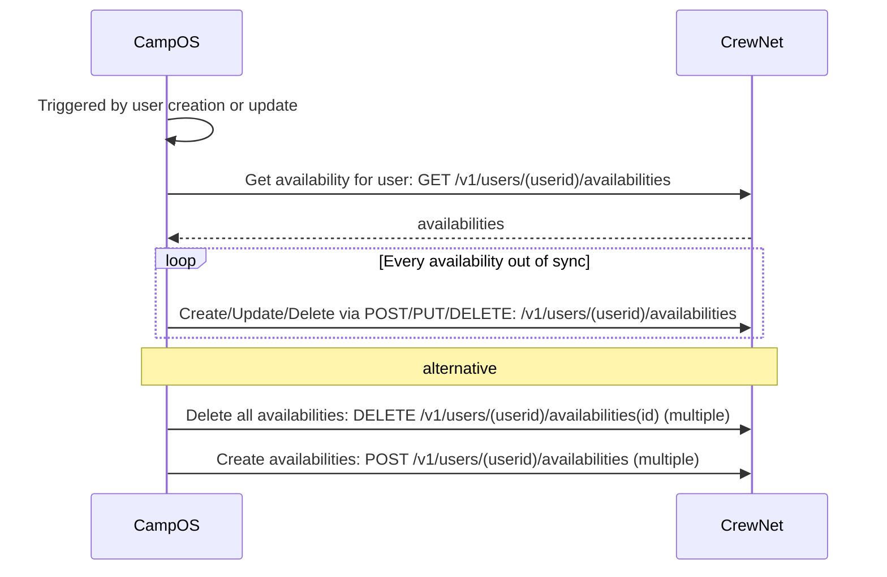

# CrewNet integration

The following document describes which parts of the CrewNet API is used by the camp, and which manual and automated processes that has been put in place to support the creation, update and synchronization of workplans.

We have the following integrations

* User creation (initial + continuous)
* User availability synchronization
* Oauth based SSO login

Besides the automatic integration driven by CampOS, we expect to have the following flows driven by ad-hoc executions of scripts:

* Workplace creation
* Workplace association

## User creation

CampOS performs a non-updating one-way synchronization of CrewNet users. When a user reaches a state in CampOS that allows it access to Crewnet, CampOS reaches out and creates the user. We currently do not have a flow for deleting users. This flow has to complete for a user before the user can log on.

We first create all outstanding users, and from that point forward all newly created users are created.

### CrewNet API used

* GET /v1/users
* POST /v1/users

### Initial user creation

### Continuous user creation

As new users becomes available in CampOS they are created in CrewNet as well.

## Availability synchronization

CampOS continuously synchronizes users availability

### CrewNet API used

* GET /v1/users/(userid)/availabilities
* POST /v1/users/(userid)/availabilities
* DELETE /v1/users/(userid)/availabilities/(id)

### User creation flow

## Single Sign on

CrewNet uses CampOS as a Oauth provider to authenticate users. We have no authorization so all users are authorized as equal (non-admins). Users are assumed to exist prior to login

### APIs

* No CrewNet API endpoints are used

### Oauth flow

Simplified oauth flow:

## Workplace creation (manual)

CampOS is not able to deduce which workplaces should exist in crewnet. As an alternative we may implement a simple tool that given a list of workplaces creates them automatically.

### CrewNet API used

* GET /v1/workplaces
* POST /v1/workplaces
* GET /v1/events/(event_id)/workplaces
* POST /v1/events/(event_id)/workplaces

### Workplace creation flow

## Add workplace members (manual)

CampOS is not able to deduce which users should be a member of a given workplace. Instead we promote a number of users to administrators and let them create their workplaces and add volunteers as members. This requires a lot of clicks in the webintefaces, so reduce the amount of manual work, we may implement a commandline interface that given a list of camp volunteers that should be members of a given workplace makes this association.

### CrewNet API used

* GET /v1/users
* GET /v1/events/(event_id)/workplaces
* GET /v1/events/(event-id)/workplaces/(workplace-id)/users
* POST /v1/events/(event-id)/workplaces/(workplace_id)/users

### Workplace member association

###
